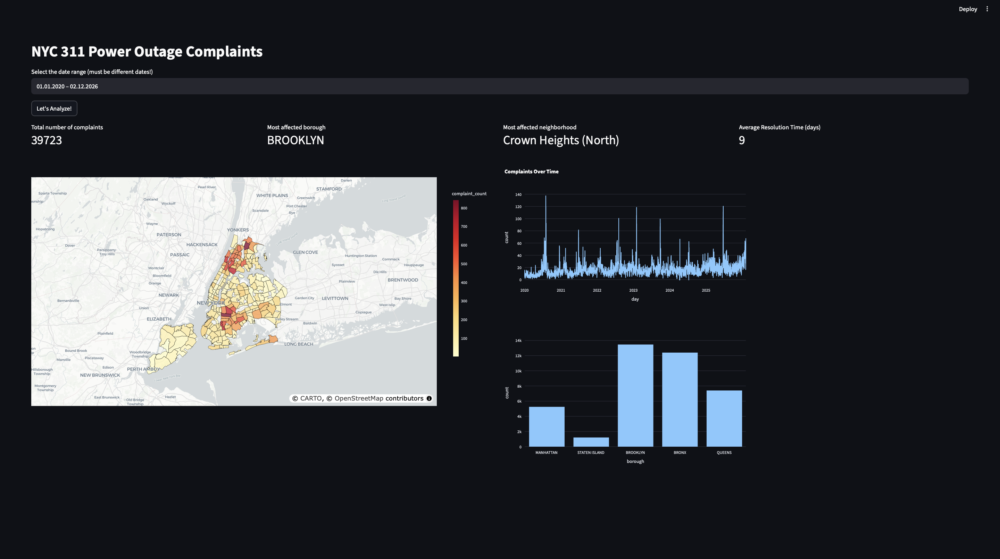

# NYC 311 Power Outage Complaints

This is an end-to-end data analytics project focused on time series and geospatial analysis. The goal of this project other than personal curiosity was to practice implementing a data pipeline - from raw data extraction and transformation to interactive visualization.

## Objective
Analyze complaint trends in the boroughs over time.

## Datasets Used
This project currently uses the following datasets:
1. [311 Service Requests from 2020 to Present](https://data.cityofnewyork.us/Social-Services/311-Service-Requests-from-2020-to-Present/erm2-nwe9/about_data) - provides information on submitted service requests
2. [2020 Neighborhood Tabulation Areas](https://data.cityofnewyork.us/City-Government/2020-Neighborhood-Tabulation-Areas-NTAs-/9nt8-h7nd/about_data) - contains geographic boundary polygons.

## Technologies 
### Data Extraction and Processing
- Python (pandas, geopandas, numpy, sqlalchemy)
### Visualization 
- Streamlit
- Plotly
### Infrastructure
- Docker (for dashboard deployment)

## Setup
git clone this repo
  Build docker image  
` docker build -t nyc-311 . `
  Run the container  
`docker run -p 8501:8501 nyc-311`

## Future Improvements
Incorporate other kinds of data (<i>hint hint look at code</i>) to perform further analysis.